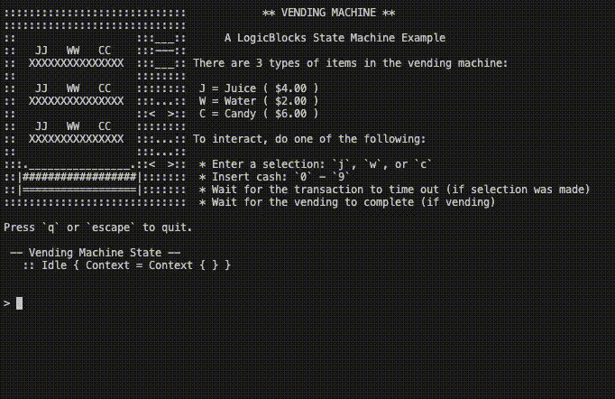
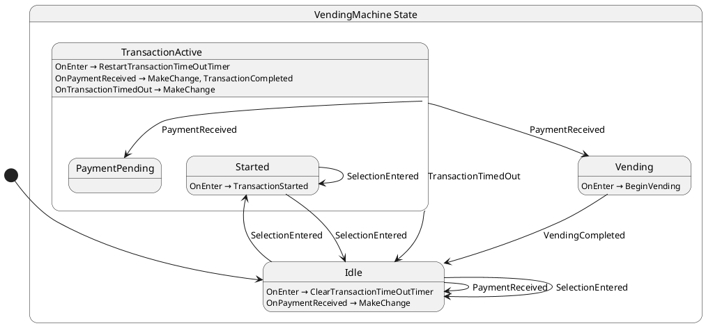

# 💡 LogicBlocks

[![Chickensoft Badge][chickensoft-badge]][chickensoft-website] [![Discord][discord-badge]][discord] [![Read the docs][read-the-docs-badge]][docs] ![line coverage][line-coverage] ![branch coverage][branch-coverage]

Human-friendly, hierarchical state machines for games and apps in C#.

---

<p align="center">

</p>

---

Logic blocks borrow from [statecharts], [state machines][state-machines], and [blocs][bloc-pattern] to provide a flexible and easy-to-use API.

Instead of requiring developers to write elaborate transition tables, LogicBlocks allow developers to define self-contained states that read like ordinary code using the [state pattern][state-pattern]. Logic blocks are intended to be refactor-friendly and grow with your project from simple state machines to nested, hierarchical statecharts.

> 🖼 Ever wondered what your code looks like? LogicBlocks includes an experimental generator that allows you to visualize your logic blocks as a state diagram — now your diagrams will always be up-to-date!

## 🙋 What is a Logic Block?

**A logic block is a class that can receive inputs, maintain a state, and produce outputs.** How you design your states is up to you. Outputs allow logic block listeners to be informed about one-shot events that aren't persisted the way state is, allowing the logic block to influence the world around it without tight coupling. Additionally, logic block states can retrieve values shared across the entire logic block from the logic block's *blackboard*.

> 🧑‍🏫 You may have noticed we borrowed the term *blackboard* from behavior trees — it's a great way to keep dependencies from being strongly coupled between the states and the logic block. Rather than being based on strings, however, the LogicBlocks blackboard allows you to request objects by type.

Here is a minimal example of a light switch. More ✨ advanced ✨ examples are linked below.

```csharp
using Chickensoft.LogicBlocks;
using Chickensoft.LogicBlocks.Generator;

[StateDiagram(typeof(State))]
public class LightSwitch : LogicBlock<LightSwitch.State> {
  public override State GetInitialState() => new State.SwitchedOff();

  public static class Input {
    public readonly record struct Toggle;
  }

  public abstract record State : StateLogic<State> {
    // "On" state
    public record SwitchedOn : State, IGet<Input.Toggle> {
      public State On(Input.Toggle input) => new SwitchedOff();
    }

    // "Off" state
    public record SwitchedOff : State, IGet<Input.Toggle> {
      public State On(Input.Toggle input) => new SwitchedOn();
    }
  }
}
```

## 🖼 Visualizing Logic Blocks

The logic blocks source generator can be used to produce a UML diagram of the statechart your code represents. It runs when you build your project (and whenever your IDE tells it to), so you'll always have an up-to-date diagram of the logic blocks in your project.

Here's the diagram that's produced by the light switch example above:

- [**`LightSwitch.cs`**](Chickensoft.LogicBlocks.Generator.Tests/test_cases/LightSwitch.cs)

  

> [!NOTE]
> To tell the LogicBlocks diagram generator to make a state diagram of your logic block, simply add a `[StateDiagram(typeof(YourLogicBlockState))]` attribute to it.

## 👷 How Do You Use a Logic Block?

To interact with a logic block, you simply give it an input. Inputs are queued up and processed one-at-a-time, in the order they were received.

```csharp
var lightSwitch = new LightSwitch();

// Toggle the light switch.
lightSwitch.Input(new LightSwitch.Input.Toggle());

// You can also access the current state any time.
lightSwitch.Value.ShouldBeOfType<LightSwitch.State.TurnedOn>();
```

Logic blocks also come with a simple binding system that allows them to be observed easily. You can create as many bindings as you need and simply dispose of them when you're done.

```csharp
var binding = lightSwitch.Bind();

binding.When<LightSwitch.State.TurnedOn>()
  .Call((state) => Console.WriteLine("Light turned on."));

binding.When<LightSwitch.State.TurnedOff>()
  .Call((state) => Console.WriteLine("Light turned off."));

// ...

binding.Dispose();
```

*Leveraging declarative bindings allows you to easily keep a view or game component in-sync with its underlying state.* You can also use the bindings for logging, triggering side effects elsewhere, or anything else you can think of.

## 👩‍🏫 Examples

Looking for more examples? Check out some of these more realistic, real-world type of scenarios.

- [**`Heater.cs`**](Chickensoft.LogicBlocks.Generator.Tests/test_cases/Heater.cs)

  

- [**`ToasterOven.cs`**](Chickensoft.LogicBlocks.Generator.Tests/test_cases/ToasterOven.cs)

  

- [**`VendingMachine.cs`**](Chickensoft.LogicBlocks.Example/VendingMachine.cs)

  The [Vending Machine Example Project](Chickensoft.LogicBlocks.Example/Program.cs) shows a fully built CLI app that simulates a vending machine, complete with timers, inventory, and cash return.

  
  
  

## 💡 Why LogicBlocks?

Logic blocks attempt to achieve the following goals:

- 🎁
  **Self-contained states**.
  
  The logic block API is modeled after [Moore machines][Moore]. Each state is a self-contained type that declares what states it can transition to by returning new states from input handlers. Conversely, logic blocks also benefit from the design of [Mealy machines][Mealy]: states can examine the previous state when entering a state, as well as examine the next state when exiting a state. This, in my opinion, combines the "best of both worlds" and plays nicely with object-oriented programming.

- 💪 **Reliable execution, even when errors occur.**

  The error handling mechanism is heavily inspired by the one from the canonical implementation of [bloc]. No more invalid transition exceptions, missing input handler warnings, etc. If a state can't handle an input, nothing happens — easy as that!

- 🎰 **Input abstraction**
  
  To interact with a logic block, you must give it an input object. In statecharts terminology, an `input` is known as an `event`, but we don't call them that to avoid confusion with C#'s notion of an `event` (which is very different).
  
  Decoupling inputs from state transitions allow the component using a logic block to be implemented more simply — it doesn't have to worry about checking the logic block's state before giving it an input. This drastically reduces conditional branching, leaving the complexity where it belongs: inside the state.

- 🪆 **Nested / hierarchical states.**

  Since logic blocks treat states as self contained objects, you can simply use inheritance to represent composite states for your state hierarchies. In addition, the relevant registered state entrance and exit callbacks are called in the correct order for hierarchical states.

- 🧨 **Capable of producing outputs**.

  Outputs are just plain objects which can contain related data that listeners may be interested in. In statecharts terminology, an output is known as an `action`, but we don't call them that to avoid confusion with C#'s notion of an `action`, which is very different.
  
  An output may be produced at any point during the execution of a logic block. Producing outputs from state input handlers allows you to trigger side effects in the outside world without your logic block having to know about it.

- 🔄 **Synchronous input processing**.

  Logic blocks always handle inputs synchronously, allowing them to power responsive user interfaces by responding to user input immediately. To handle long-running operations, you can leverage an event-driven pattern or hang onto ongoing `Task` references yourself from the state that's leveraging them.
  
  Being synchronous-by-default also helps with performance and simplicity, which makes single-threaded game logic a cinch.

- 📝 **Ordered input processing.**

  All inputs are processed one-at-a-time in the order received. If the current state does not have an input handler for the current input, the input is simply discarded.

- 👩‍💻 **Developer-friendly.**

  Logic blocks are designed to be ergonomic, refactor-friendly, and scale with you as you iterate on your intended state behaviors.

  If for any reason you ever decide to migrate away from logic blocks to a table-based state machine approach, the conversion from a Moore machine (self-contained states also leveraged by LogicBlocks) to a Mealy machine (transition-based logic) is [quite trivial](https://electronics.stackexchange.com/a/73397). The other way around is not nearly as easy.

- 🤝 **Compatibility.**

  Works anywhere `netstandard2.1` is supported. Use with Godot, Unity, or other C# projects.

- 🪢 **Fluent bindings built-in**.

  Logic blocks come with `Binding`, a utility class that provides a fluent API for monitoring states and outputs. Binding to a logic block is as simple as calling `myLogicBlock.Bind()`.

- 🧪 **Testable.**

  Logic blocks are easily tested using traditional mocking tools. You can mock the logic block, its context, and its bindings to unit-test your logic block states and logic block consumers in isolation.

## 📦 Installation

You can find the latest version of LogicBlocks on [nuget][logic-blocks-nuget].

```sh
dotnet add package Chickensoft.LogicBlocks
```

To use the LogicBlocks source generator, add the following to your `.csproj` file. Make sure to replace `3.0.0` with the latest version of the [LogicBlocks generator from nuget][logic-blocks-gen-nuget].

```xml
  <PackageReference Include="Chickensoft.LogicBlocks.Generator" Version="3.0.0" PrivateAssets="all" OutputItemType="analyzer" />
```

Once you have both packages installed, you can force diagram generation with the following command in your project:

```sh
dotnet build --no-incremental
```

## 📚 Getting Started

Since LogicBlocks are based on statecharts, it helps to understand the basics of statecharts. Here are a few resources to help you get started:

- [Introduction to State Machines and Statecharts][xstate-intro]
- [Statecharts.dev][statecharts]
- [UML State Machine (Wikipedia)][uml-state-machine]

### ✨ Creating a LogicBlock

To make a logic block, you'll need an idea for a state machine or statechart. Drawing one out from a diagram (or implementing an existing diagram) is a great way to get started.

Once you have a basic idea of what you want to build, create a new class for your machine and simply extend `LogicBlock`.

For this example, we'll create a simple state machine that models a space heater — the type you might use to a heat a room when it's cold outside.

Our space heater will have access to a temperature provider service. The interface for such a provider will be assumed to be the following:

```csharp
/// <summary>
/// Temperature sensor that presumably communicates with actual hardware
/// (not shown here).
/// </summary>
public interface ITemperatureSensor {
  /// <summary>Last recorded air temperature.</summary>
  double AirTemp { get; }
  /// <summary>Invoked whenever a change in temperature is noticed.</summary>
  event Action<double>? OnTemperatureChanged;
}
```

More on that in a moment, though.

#### Declaring the Logic Block

We need to create a basic scaffold for our logic block that includes a base state type. All of the other states used by the logic block will extend the base state type (or at least be descendants of it in their inheritance hierarchies). The base state has to be defined inside the logic block as a [nested type][nested-types] so that it can access the types needed by LogicBlocks under-the-hood.

> Whenever a logic block state is attached to a logic block as the current state, it'll get its own copy of the logic block's context. The logic block context allows states to produce outputs, access dependencies from the blackboard, and even add inputs to the logic block that they belong to.

We'll also create a constructor that accepts the dependencies our logic block states will need. In this case, we'll need the aforementioned temperature sensor object. In the constructor, we'll add it to the logic block's *blackboard* — the shared collection of data that can be accessed by any logic block state.

```csharp
using Chickensoft.LogicBlocks;
using Chickensoft.LogicBlocks.Generator;

[StateDiagram(typeof(State))]
public class Heater : LogicBlock<Heater.State> {
    public static class Input { }

    public abstract record State : StateLogic { }
    
    public abstract record Output { }

    public Heater(ITemperatureSensor tempSensor) {
      // Add the temperature sensor to the blackboard so states can use it.
      Set(tempSensor);
    }
  }
```

> Subclassing `LogicBlock` also requires us to implement the `GetInitialState` method, but we don't have any states yet so we'll implement it later.

In general, Logic block state types should be records that extend the `StateLogic` record. The `StateLogic` record is provided by LogicBlocks and allows states to keep track of entrance/exit callbacks.

> [C# records][records] are just reference types that are identical to classes, with the added improvement of providing shallow equality comparison for free.
>
> LogicBlocks is optimized to avoid transitioning to identical subsequent states, so using records allows us to take advantage of that without any effort on our part.

We've also created a couple of empty static classes, `Input`, and `Output`. These aren't required for LogicBlocks, it just helps organize our inputs and outputs so we can see them all in one place. It's nice to be able to scroll up or down in your file and see what all inputs and outputs a logic block can use.

Finally, we added the `[StateDiagram(typeof(State))]` attribute to our logic block class to tell the LogicBlocks source generator about our machine. Putting the `[StateDiagram(typeof(...))]` attribute on a logic block allows the LogicBlocks generator to find the logic block and generate the UML diagram code needed to visualize it as a picture.

> [!NOTE]
> The type you provide to `StateDiagram` should be the concrete type of your base state, not an interface.

### ⤵️ Defining Inputs and Outputs

Now that we've stubbed out a logic block, we can define our inputs and outputs. Naturally, these will be specific to the problem at hand.

Inputs are just values that contain whatever data is needed for the state to do its job. A logic block queues inputs up and processes them one at a time. The current state is responsible for handling whatever input is currently being processed. If it doesn't handle it, the input is simply discarded and any remaining inputs are processed the same way.

Outputs are one-shot values that are produced by states and sent to any listeners of the logic block. Outputs can be used to keep views or other visualization systems (like game components) in-sync with the current state of the machine.

```csharp
  public static class Input {
    public readonly record struct TurnOn;
    public readonly record struct TurnOff;
    public readonly record struct TargetTempChanged(double Temp);
    public readonly record struct AirTempSensorChanged(double AirTemp);
  }

  public static class Output {
    public readonly record struct FinishedHeating;
  }
```

Each of our inputs represent something that has happened related to the machine we're designing. Since we're modeling a space heater, we've provided inputs for all the things that might happen, such as turning it on and off, changing the target temperature, and receiving a new reading from the air temperature sensor. We also want to know when the room has reached the desired target temperature, so we've added a `FinishedHeating` output.

> You probably noticed that we made each input and output a `readonly record struct`. Using a record type allows us to take advantage of the shorthand [primary constructor] syntax, drastically reducing the amount of typing we need to do for simple data objects.
>
> Additionally, using `readonly record struct` for outputs will generally allow the C# compiler to keep them on the stack, too. If we used a non-value type (a normal record or class), they'd almost certainly end up being allocated on the heap, which can be expensive. Since it's not uncommon to add inputs and produce outputs nearly every frame of a video game or other highly interactive system, it's important to do this with as few heap allocations as possible.

### 💡 Defining States

We know our space heater will be in one of three states: `Off`, `Idle` (on but not heating), and `Heating` (on *and* heating). Since our imaginary space heater has a knob that controls the desired room temperature (the target temperature), we know that all of our states should have a `TargetTemp` property. Finally, we want our space heater to automatically start and stop heating on its own based on the air temperature readings.

Let's first define the information and behavior common to every state. We know that if you spin the temperature knob, the heater's target temperature should change *regardless* of what state it is in. So let's add a `TargetTemp` property and an input handler for changing the target temperature on the base state itself. This way, all the other states that inherit from it will get that functionality for free. This makes sense, too, since you can turn the temperature knob regardless of whether the heater is on or off.

```csharp
[StateDiagram(typeof(State))]
public class Heater : LogicBlock<Heater.State> {
  ...

  public abstract record State : StateLogic, IGet<Input.TargetTempChanged> {
    public double TargetTemp { get; init; }

    public State On(Input.TargetTempChanged input) => this with {
      TargetTemp = input.Temp
    };
  }

  ...
}
```

That looks pretty good: whenever the imaginary temperature knob on our space heater is turned, it will update the state's `TargetTemp` property.

Let's make our `Off` state. It'll be pretty simple. It just needs to receive the `TurnOn` event and check the temperature sensor to see if it needs to go directly to the `Heating` state or if it should go to the `Idle` state.

```csharp
public record Off : State, IGet<Input.TurnOn> {
  public State On(Input.TurnOn input) {
    var tempSensor = Context.Get<ITemperatureSensor>();

    if (tempSensor.AirTemp >= TargetTemp) {
      // Room is already hot enough.
      return new Idle() { TargetTemp = TargetTemp };
    }

    // Room is too cold — start heating.
    return new Heating() { TargetTemp = TargetTemp };
  }
}
```

Notice how we used `Context.Get<ITemperatureSensor>` to get the temperature sensor — this is how we get dependencies from the logic block's blackboard.

We'll need to use the inheritance trick again: both our `Idle` and `Heating` states can be turned off, so we'll make another abstract state class called `Powered` that represents the heater being on.

```csharp
public abstract record Powered : State, IGet<Input.TurnOff> {
  public Powered() {
    // Whenever a Powered state is entered, play a chime to
    // alert the user that the heater is on. Subsequent states that
    // inherit from Powered will not play a chime until a different
    // state has been entered before returning to a Powered state.
    this.OnEnter(() => Context.Output(new Output.Chime()));

    // Unlike OnEnter, OnAttach will run for every state instance that
    // inherits from this record. Use these to setup your state.
    //
    // Attach and detach are great for setting up long-running operations.
    OnAttach(
      () => Get<ITemperatureSensor>().OnTemperatureChanged += OnTemperatureChanged
    );

    OnDetach(
      () => Get<ITemperatureSensor>().OnTemperatureChanged -= OnTemperatureChanged
    );
  }

  public State On(Input.TurnOff input) =>
    new Off() { TargetTemp = TargetTemp };

  // Whenever our temperature sensor gives us a reading, we will just
  // provide an input to ourselves. This lets us have a chance to change
  // the logic block's state.
  private void OnTemperatureChanged(double airTemp) =>
    Context.Input(new Input.AirTempSensorChanged(airTemp));
}
```

The `Powered` state is a lot more interesting. The constructor registers attach and detach callbacks, which will be called for every instance of a state that extends the `Powered` class. It also registers an entrance callback that will be called whenever the state machine transitions into a state that inherits from a Powered state after being in a non-powered state.

> 💡 `OnAttach` and `OnDetach` are different from `OnEnter` and `OnExit`. `OnEnter` and `OnExit` respect a state's type hierarchy: i.e., if you enter into a state that extends `Powered`, and then enter into a different state that also extends `Powered`, the OnEnter callbacks for `Powered` will only be invoked once. On the other hand, `OnAttach` and `OnDetach` are invoked for every state that extends `Powered` that is entered into.
>
> You should think of `OnEnter` and `OnExit` as the place to execute theoretically-correct behavior (like producing outputs), and `OnAttach` and `OnDetach` to setup your practical behavior (such as registering event handlers or performing mundane setup).
>
> Finally, *the distinction between state attachment and entrance is important for serialization*. When deserializing a state machine, you don't want to re-invoke entrance callbacks, but you do need to perform any setup that would have been done before the state machine was serialized. Attachment callbacks allow states to be spun back up when deserializing without producing unintended side-effects.

In the attachment callback, the `Powered` state subscribes to the `OnTemperatureChanged` event of the temperature sensor. Likewise, it unsubscribes before detaching from the logic block.

Whenever the air temperature sensor informs us of a new value, the private method on the state, `OnTemperatureChanged` is invoked. It uses the context to fire an input on the logic block that owns the state. The input will be handled by the logic block's current state, which in this case would just be the state that's triggering the input, `Powered`. This is a nice trick for creating subscriptions to services that allow a state to trigger state transitions in response to an event happening elsewhere.

> Note that we used a method provided on our state `Get<TDataType>()`: it's shorthand for the `Context.Get` method shown above, but saves us some typing.

Now let's add the `Idle` state. All it needs to do is respond to changes in air temperature and start heating once the temperature drops too far below the target temperature. Since `Idle` will extend `Powered`, it will automatically be subscribed to the changes in air temperature, which will cause it to receive `AirTempSensorChanged` inputs.

```csharp
public record Idle : Powered, IGet<Input.AirTempSensorChanged> {
  public State On(Input.AirTempSensorChanged input) {
    if (input.AirTemp < TargetTemp - 3.0d) {
      // Temperature has fallen too far below target temp — start heating.
      return new Heating() { TargetTemp = TargetTemp };
    }
    // Room is still hot enough — keep waiting.
    return this;
  }
}
```

Finally, we need to make the `Heating` state. It'll function like Idle, but instead of turning on the heat, it will go back to idling when the room has reached the target temperature.

```csharp
public record Heating : Powered, IGet<Input.AirTempSensorChanged> {
  public State On(Input.AirTempSensorChanged input) {
    if (input.AirTemp >= TargetTemp) {
      // We're done heating!
      Context.Output(new Output.FinishedHeating());
      return new Idle() { TargetTemp = TargetTemp };
    }
    // Room isn't hot enough — keep heating.
    return this;
  }
}
```

When the `AirTempSensorChanged` input is processed, it checks to see if the new temperature is at or above the target temperature. If it is, it fires the `FinishedHeating` output to let any logic block listeners know that we succeeded in our job as a space heater. It then returns an `Idle` state.

We're just about done with our logic block — all we need to do is define the initial state!

```csharp
[StateDiagram(typeof(State))]
public class Heater :
  LogicBlock<Heater.Input, Heater.State> {
  ...

  public override State GetInitialState() => new State.Off() {
    TargetTemp = 72.0
  };

  ...
}
```

Every time we make a logic block class, we'll have to override `GetInitialState` to provide the starting state. In this case, we simply return the `Off` state with a target temperature of 72 degrees (fahrenheit).

### 🪢 Binding to the LogicBlock

In case you missed it above, the completed space heater example is available  in [`Heater.cs`](Chickensoft.LogicBlocks.Generator.Tests/test_cases/Heater.cs).

To use our logic block, we'd have to first make a temperature sensor that conforms to the `ITemperatureSensor` interface we mentioned above.

```csharp
public record TemperatureSensor : ITemperatureSensor {
  public double AirTemp { get; set; } = 72.0d;
  public event Action<double>? OnTemperatureChanged;

  public void UpdateReading(double airTemp) {
    AirTemp = airTemp;
    OnTemperatureChanged?.Invoke(airTemp);
  }
}
```

That'll do. Now, somewhere in our app or game's code, we can create a new instance of our logic block and bind to it.

```csharp
var tempSensor = new TemperatureSensor();
var heater = new Heater(tempSensor);

using var binding = heater.Bind();

var messages = new List<string>();

// Handle an output produced by the heater.
binding.Handle<Heater.Output.FinishedHeating>(
  (output) => messages.Add("Finished heating :)")
);

binding.When<Heater.State.Off>().Call(
  (state) => messages.Add("Heater turned off")
);

// Listen to all states that inherit from Heater.State.Powered.
binding.When<Heater.State.Powered>().Call(
  (state) => messages.Add("Heater is powered")
);

binding.When<Heater.State.Idle>().Call(
  (state) => messages.Add("Heater is idling")
);

binding.When<Heater.State.Heating>().Call(
  (state) => messages.Add("Heater is heating")
);

binding.When<Heater.State>()
  .Use(
    data: (state) => state.TargetTemp,
    to: (temp) => Console.WriteLine($"Heater target temp changed to {temp}")
  );

heater.Input(new Heater.Input.TurnOn());

// Dropping the temp below target should move it from idling to heating
tempSensor.UpdateReading(66.0);
// Raising the temp above target should move it from heating back to idling
tempSensor.UpdateReading(74);

messages.ShouldBe(new string[] {
  "Heater is powered",
  "Heater is idling",
  "Heater is powered",
  "Heater is heating",
  "Finished heating :)",
  "Heater is powered",
  "Heater is idling"
});
```

Please remember that a logic block's binding is disposable. You'll need to retain a reference to the binding for the life of the logic block and then dispose of it when you're done.

Bindings will not re-run callbacks if the state or selected data from the state has not changed.

## 🔮 Additional Tips

### ♻️ Reusing Inputs, States and Outputs

If you need to write performant code that avoids heap allocations in memory, you can reuse inputs and states. If you're using `readonly record struct` for outputs, they should already be avoiding the heap.

For ease of use, consider passing any dependencies your states will need into the constructor of your logic block. Then, in the constructor, create the states that your logic block will use. Finally, in your `GetInitialState` method, return the initial state by looking it up in the blackboard.

```csharp
namespace Chickensoft.LogicBlocks.Tests.Fixtures;

using Chickensoft.LogicBlocks.Generator;

[StateDiagram(typeof(State))]
public partial class MyLogicBlock : LogicBlock<MyLogicBlock.State> {
  public static class Input { ... }
  public abstract record State : StateLogic { ... }
  public static class Output { ... }

  public MyLogicBlock(IMyDependency dependency) {
    // Add dependencies and pre-created states to the blackboard so that states
    // can reuse them.
    Set(dependency);

    // Add pre-created states to the blackboard so that states can look them up
    // instead of having to create them.
    Set(new State.MyFirstState());
    Set(new State.MySecondState());
  }

  // Return the initial state by looking it up in the blackboard.
  public override State GetInitialState() => Context.Get<MyFirstState>();
}
```

Elsewhere, inside your states, you can lookup the state you want to transition to.

```csharp
public record MyFirstState : IGet<Input.SomeInput> {
  public State On(Input.SomeInput input) {
    // Lookup the state we want to go to.
    var nextState = Context.Get<MySecondState>();
    // Transition to the pre-made state.
    return nextState;
  }
}
```

> 🚨 Reusing states incorrectly can break bindings if you change the properties on a reused state before transitioning to it since the bindings only cache states by reference. To avoid this, don't add any additional properties to your reusable states — instead, use the blackboard to store relevant data across all the states.

### 🎤 Events

You can manually subscribe to a logic block's events if you need total control of a logic block. Manually subscribing to events can allow you to create a custom binding system or other such system which can watch inputs, handle outputs, and catch errors.

```csharp
var logic = new MyLogicBlock();

logic.OnInput += OnInput;
logic.OnState += OnState;
logic.OnOutput += OnOutput;
logic.OnError += OnError;

public void OnInput(object input) =>
  Console.WriteLine($"Input being processed: {input}");

public void OnState(MyLogicBlock.State state) =>
  Console.WriteLine($"State changed: {state}");

public void OnOutput(object output) =>
  Console.WriteLine($"Output: {output}");

public void OnError(Exception error) =>
  Console.WriteLine($"Error occurred: {error}");
```

As with any C# events, be sure to unsubscribe when you're done listening to the logic block to avoid creating a memory leak.

```csharp
logic.OnInput -= OnInput;
logic.OnState -= OnState;
logic.OnOutput -= OnOutput;
logic.OnError -= OnError;
```

### 📛 Error Handling

By default, exceptions thrown in states do not cause the logic block to stop processing inputs. Instead, the logic block will invoke the `OnError` event and continue processing inputs.

There are two ways to add errors to a logic block. The first is to throw an exception in a state's input handler. The second is to call the `AddError(Exception e)` method on the context. Regardless of which way you choose, both methods will cause the logic block to invoke its `HandleError` method. The only difference is in whether or not your state's input handler continues running. Naturally, throwing an exception aborts execution of the method, while calling `Context.AddError` will continue executing as normal.

```csharp
// Somewhere inside your logic block...

public record MyState : State IGet<Input.SomeInput> {
  ...

  public void On(Input.SomeInput input) {
    // Add an error to the logic block.
    Context.AddError(new InvalidOperationException("Oops."));

    // Same as above, but breaks out of the method.
    throw new InvalidOperationException("Oops.");

    // Use Context.AddError if you need to continue execution inside your 
    // state method. Otherwise, feel free to throw.
  }

}
```

In situations where you want to have manual control over whether thrown exceptions stop the application (or not), you can override the `HandleError` method in your logic block.

```csharp
[StateDiagram(typeof(State))]
public partial class MyLogicBlock : LogicBlock<MyLogicBlock.State> {

  ...

  protected override void HandleError(Exception e) {
    // This is a great place to log errors.

    // Or you can stop execution on any exception that occurs inside a state.
    throw e; 
  }

  ...
}
```

### 💥 Initial State Side Effects

By default, LogicBlocks doesn't invoke any `OnEnter` callbacks registered by the initial state, since the state property lazily creates the initial state the first time it is accessed. Lazily creating the state allows the LogicBlocks API to be more ergonomic.

> [!NOTE]
> If the state wasn't initialized lazily, the base LogicBlock constructor would have to set the first state before you have a chance to add anything to the logic block's blackboard, making it difficult to create states that have blackboard dependencies.

That being said, **there are plenty of times when you *do* want to run the entrance callbacks for the initial state because you *do* want the bindings to trigger**.

To force the LogicBlock to run the entrance callbacks and create the initial state (if it hasn't already), simply call the `Start()` method on your logic block.

```csharp
var logic = new MyLogicBlock();
var binding = logic.Bind();
binding.Handle<MyLogicBlock.Output.SomeOutput>(
  (output) => { ... }
);

// Run initial state's entrance callbacks. Essentially, this forces any 
// relevant bindings to run in response to the first state, ensuring that 
// whatever is consuming the logic block is in-sync with the initial state.
logic.Start();
```

Likewise, when you are done with your logic block, you can run the exit callbacks for the final state by calling `Stop`.

```csharp
logic.Stop(); // Runs OnExit callbacks for the current (presumably final) state.
```

### 🧪 Testing

LogicBlocks, contexts, and bindings can all be mocked. However, mocking contexts and bindings can be a bit of a chore, so LogicBlocks allows you to create fake bindings and contexts that make testing a lot simpler.

Let's take a look at some examples.

#### Testing LogicBlock Consumers

Imagine you have an object named `MyObject` that uses a logic block called [`MyLogicBlock`](Chickensoft.LogicBlocks.Tests/test/fixtures/MyLogicBlock.cs).

The object does two things: it registers a single binding to observe `SomeOutput` and has a method `DoSomething` that adds the `SomeInput` input to the logic block it uses.

```csharp
public class MyObject : IDisposable {
  public IMyLogicBlock Logic { get; }
  public MyLogicBlock.IBinding Binding { get; }

  public bool SawSomeOutput { get; private set; }

  public MyObject(IMyLogicBlock logic) {
    Logic = logic;
    Binding = logic.Bind();

    Binding.Handle<MyLogicBlock.Output.SomeOutput>(
      (output) => SawSomeOutput = true
    );
  }

  // Method we want to test
  public void DoSomething() => Logic.Input(new MyLogicBlock.Input.SomeInput());

  public void Dispose() {
    Binding.Dispose();
    GC.SuppressFinalize(this);
  }
}
```

To write a unit test for `MyObject`, we need to mock its dependencies and then verify that it interacts with the dependencies in the way we expect. In this case, the only dependency is the logic block. We can mock it in the same way we mock other objects.

Since the object binds to the logic block in its constructor, we need to somehow intercept that request. We can take advantage of the static method `CreateFakeBinding()` present on every logic block and setup our mock logic block to return the fake binding when it's asked to bind. This way, the object can register binding callbacks as usual without knowing it's actually using a fake binding system under-the-hood.

```csharp
using Moq;
using Shouldly;
using Xunit;

public class MyObjectTest {
  [Fact]
  public void DoSomethingDoesSomething() {
    // Our unit test follows the AAA pattern: Arrange, Act, Assert.
    // Or Setup, Execute, and Verify, if you prefer.

    // Setup — make a fake binding and return that from our mock logic block
    using var binding = MyLogicBlock.CreateFakeBinding();

    var logic = new Mock<IMyLogicBlock>();
    logic.Setup(logic => logic.Bind()).Returns(binding);
    logic.Setup(logic => logic.Input(It.IsAny<MyLogicBlock.Input.SomeInput>()));

    using var myObject = new MyObject(logic.Object);

    // Execute — run the method we're testing
    myObject.DoSomething();

    // Verify — check that the mock object's stubbed methods were called
    logic.VerifyAll();
  }

  // ...
```

Finally, we want to test that the bindings actually get invoked when the logic block produces the output `SomeOutput`. To do this, we can simulate an output being produced by the logic block using the fake binding's `Output()` method.

> 💡 Fake bindings can also simulate changing states, adding inputs, and errors via the `SetState()`, `Input()`, and `AddError()` methods, respectively.

```csharp
  // ...

  [Fact]
  public void HandlesSomeOutput() {
    // Setup — make a fake binding and return that from our mock logic block
    using var binding = MyLogicBlock.CreateFakeBinding();

    var logic = new Mock<IMyLogicBlock>();
    logic.Setup(logic => logic.Bind()).Returns(binding);

    using var myObject = new MyObject(logic.Object);

    // Execute — trigger an output from the fake binding!
    binding.Output(new MyLogicBlock.Output.SomeOutput());

    // Verify — verify object's callback was invoked by checking side effects
    myObject.SawSomeOutput.ShouldBeTrue();
  }
}
```

#### Testing LogicBlock States

We can also test that our logic block states work correctly. Traditionally, this would be done by mocking the logic block context that is given to the state and expecting the state to call certain methods on it, and then verifying that the state performed the correct interactions with the context.

That's a lot of typing, though. Fortunately, LogicBlocks provides a `CreateFakeContext()` method available on every logic block state. The fake context allows us to see what inputs, outputs, and errors were added by the state without having to do a ton of method stubbing on our mocks.

For example, let's pretend we want to test the state `SomeState` on `MyLogicBlock`.

For reference, here is the definition of `SomeState`. When it's entered and exited, it outputs the output `SomeOutput`. In addition, when it receives the `SomeInput` input it also outputs `SomeOutput` again and transitions to `SomeOtherState`.

```csharp
// ...
public record SomeState : State, IGet<Input.SomeInput> {
  public SomeState() {
    this.OnEnter(() => Context.Output(new Output.SomeOutput()));
    this.OnExit(() => Context.Output(new Output.SomeOutput()));
  }

  public IState On(Input.SomeInput input) {
    Context.Output(new Output.SomeOutput());
    return new SomeOtherState();
  }
}
// ...
```

We can easily test the enter and exit methods by calling `Enter()` and `Exit()` on the state itself. By providing our state with a fake context, we can verify if it performed the correct actions.

```csharp
using Chickensoft.LogicBlocks.Tests.Fixtures;
using Shouldly;
using Xunit;

public class SomeStateTest {
  [Fact]
  public void SomeStateEnters() {
    var state = new MyLogicBlock.State.SomeState();
    var context = state.CreateFakeContext();

    state.Enter();

    context.Outputs.ShouldBe(
      new object[] { new MyLogicBlock.Output.SomeOutput() }
    );
  }

  [Fact]
  public void SomeStateExits() {
    var state = new MyLogicBlock.State.SomeState();
    var context = state.CreateFakeContext();

    state.Exit();

    context.Outputs.ShouldBe(
      new object[] { new MyLogicBlock.Output.SomeOutput() }
    );
  }

  // ...
```

We checked the outputs added to the fake context to make sure they were correct. We could also check the inputs and errors, too.

> 💡 If you need to reset the fake context and clear everything it recorded, you can call `context.Reset()`.

Finally, we can test the input handler by calling the `On()` method on the state itself. Once again, we can use the fake context to verify that the state added the correct outputs.

```csharp
  // ...

  [Fact]
  public void GoesToSomeOtherStateOnSomeInput() {
    var state = new MyLogicBlock.State.SomeState();
    var context = state.CreateFakeContext();

    var nextState = state.On(new MyLogicBlock.Input.SomeInput());

    nextState.ShouldBeOfType<MyLogicBlock.State.SomeOtherState>();

    context.Outputs.ShouldBe(
      new object[] { new MyLogicBlock.Output.SomeOutput() }
    );
  }
}
```

#### Fake Binding

Fake bindings allow you to simulate a number of actions:

```csharp
[Fact]
public void MyTest() {
  using var binding = MyLogicBlock.CreateFakeBinding();

  var logic = new Mock<IMyLogicBlock>();
  logic.Setup(logic => logic.Bind()).Returns(binding);

  // ...

  // Simulate a state change
  binding.SetState(new MyLogicBlock.State.SomeState());

  // Simulate an input
  binding.Input(new MyLogicBlock.Input.SomeInput());

  // Simulate an output
  binding.Output(new MyLogicBlock.Output.SomeOutput());

  // Simulate an error being added
  binding.AddError(new InvalidOperationException("Oops!"));

  // ...
}
```

#### Fake Context

A fake context allows you to record interactions triggered by the state you're testing.

```csharp
[Fact]
public void MyTest() {
  var state = new MyLogicBlock.State.SomeState();
  var context = state.CreateFakeContext();

  // ...

  // Set blackboard dependency
  context.Set<IMyDependency>(new Mock<IMyDependency>());

  // Set multiple blackboard dependencies at once
  context.Set(
    new Dictionary<Type, object>() {
      [typeof(IMyDependency)] = new Mock<IMyDependency>(),
      [typeof(IMyOtherDependency)] = new Mock<IMyOtherDependency>()
    }
  );

  // Check the inputs added by the state
  context.Inputs.ShouldBe(
    new object[] { new MyLogicBlock.Input.SomeInput() }
  );

  // Check the outputs added by the state
  context.Outputs.ShouldBe(
    new object[] { new MyLogicBlock.Output.SomeOutput() }
  );

  // Check the errors added by the state
  context.Errors.ShouldBe(
    new Exception[] { new InvalidOperationException("Oops!") }
  );

  // Reset the context, clearing all recorded interactions and dependencies
  context.Reset();

  // ...
}
```

## 🖼 Generating State Diagrams

The LogicBlocks generator can generate UML code that can be used to visualize the statechart that your code represents.

> 🪄 Generating diagrams based on code promotes a code-first solution: instead of having to maintain a separate diagram, your code acts as the source of truth for your state machines. As a bonus, your diagrams will never be out of date!

See [installation](#-installation) for instructions on installing the LogicBlocks source generator.

To instruct the LogicBlocks generator to create a UML state diagram for your code, add the `[StateDiagram]` attribute to your LogicBlock's definition:

```csharp
[StateDiagram(typeof(State))]
public class LightSwitch : LogicBlock<LightSwitch.Input, LightSwitch.State> {
```

State diagrams will be generated for each logic block with the `[StateDiagram]` attribute in your project. The diagram code is placed next to your LogicBlock's source file with the extension `.g.puml`.

For example, here's the UML generated for the `VendingMachine` example mentioned above:



> 💡 The snippet above is simplified for the sake of example. The actual generator output is a bit more verbose, but it renders the same diagram. The extra verbosity is required to identify states correctly to avoid naming collisions between nested states.
>
> If you want a more advanced look, check out the various `*.puml` files throughout the various packages in the LogicBlocks repository. These files are generated by the LogicBlocks Generator from the included examples and test cases that are used to verify that LogicBlocks is working as intended. Next to each `*.puml` file is a LogicBlock source file with the `[StateDiagram]` attribute that informs the generator to create the diagram code. Check out the source and compare it to the diagram code to see what the generator is doing under the hood.

### Viewing Diagrams with PlantUML

You can copy and paste the generated UML into [PlantText] to generate a diagram online.

Alternatively, you can install PlantUML locally and/or use the [jebbs.plantuml] VSCode extension to render UML state diagrams that represent your machine.

Installation steps (for macOS):

```sh
brew install graphviz
brew install plantuml

# To start your own PlantUML server:
java -jar /opt/homebrew/Cellar/plantuml/1.2023.9/libexec/plantuml.jar -picoweb
# ^ May need to change path above to match the version you installed.
# Try `brew info plantuml` to see where PlantUML is installed.
```

Once the server is running, you can preview the diagram by opening the VSCode command menu and selecting "PlantUML: Preview Current Diagram".

## 🐛 Troubleshooting

### `Cannot get value from a logic block with an uninitialized context.`

Since version 4.x, LogicBlocks initializes the context lazily. The context is not available in the constructor outside of the `OnEnter/Exit/Attach/Detach` methods.

Wrong:

```c#
public Active() {
  var value = Get<int>();
  this.OnEnter(() => Context.Output(new Output.ValueChanged(value)));
}
```

Correct:

```c#
public Active() {
  this.OnEnter(
    () => {
      var value = Get<int>();
      Context.Output(new Output.ValueChanged(value));
    }
  );
}
```

## 📺 Credits

Conceptually, logic blocks draw from a number of inspirations:

- 📊 [Statecharts][statecharts]

  Logic block outputs are actually just ["actions"](https://statecharts.dev/glossary/action.html), as described by statecharts.

  Outputs provide a way of communicating with the world outside the logic block without introducing strong coupling between the logic block and whatever is listening to it (like a game engine component or a view).

  Logic block states can also use normal object-oriented programming patterns like inheritance and composition to recreate the nested or hierarchical nature of statecharts.

- 🧊 [Bloc][bloc]

  Logic blocks borrow heavily from the conventions put forth by bloc: notably, `On<TInput>`-style input handlers, inheritance-based states, `AddError`, and `OnError`.

- 🎰 [Finite state machines][state-machines].

  The logic blocks API is heavily inspired by [Moore] and [Mealy] state machines.

  Defining logic in terms of transitions is the definition of a Mealy state machine (see above). Unfortunately, requiring developers to create logic in terms of transitions is a bit clunky. Oftentimes, many transitions share common code which must be factored out. Forgetting to call the shared code from each relevant transition introduces serious logic errors. Instead, the logic blocks API embraces self-contained states that are invoked when entered and exited. Logic blocks do, however, provide a way to monitor transitions so that you can produce outputs when certain transitions occur, but they do not permit you to change the state while observing a transition.

[chickensoft-badge]: https://raw.githubusercontent.com/chickensoft-games/chickensoft_site/main/static/img/badges/chickensoft_badge.svg
[chickensoft-website]: https://chickensoft.games
[discord-badge]: https://raw.githubusercontent.com/chickensoft-games/chickensoft_site/main/static/img/badges/discord_badge.svg
[discord]: https://discord.gg/gSjaPgMmYW
[read-the-docs-badge]: https://raw.githubusercontent.com/chickensoft-games/chickensoft_site/main/static/img/badges/read_the_docs_badge.svg
[docs]: https://chickensoft.games/docs
[branch-coverage]: Chickensoft.LogicBlocks.Tests/badges/branch_coverage.svg
[line-coverage]: Chickensoft.LogicBlocks.Tests/badges/line_coverage.svg
[bloc]: https://bloclibrary.dev/#/
[bloc-pattern]: https://www.flutteris.com/blog/en/reactive-programming-streams-bloc
[state-machines]: https://en.wikipedia.org/wiki/Finite-state_machine
[Moore]: https://en.wikipedia.org/wiki/Moore_machine
[Mealy]: https://en.wikipedia.org/wiki/Mealy_machine
[state-pattern]: https://en.wikipedia.org/wiki/State_pattern
[statecharts]: https://statecharts.dev/
[jebbs.plantuml]: https://marketplace.visualstudio.com/items?itemName=jebbs.plantuml
[logic-blocks-nuget]: https://www.nuget.org/packages/Chickensoft.LogicBlocks/
[logic-blocks-gen-nuget]: https://www.nuget.org/packages/Chickensoft.LogicBlocks.Generator/
[uml-state-machine]: https://en.wikipedia.org/wiki/UML_state_machine
[xstate-intro]: https://xstate.js.org/docs/guides/introduction-to-state-machines-and-statecharts/
[records]: https://learn.microsoft.com/en-us/dotnet/csharp/whats-new/tutorials/records
[primary constructor]: https://learn.microsoft.com/en-us/dotnet/csharp/language-reference/builtin-types/record
[nested-types]: https://learn.microsoft.com/en-us/dotnet/csharp/programming-guide/classes-and-structs/nested-types
[PlantText]: https://www.planttext.com/
