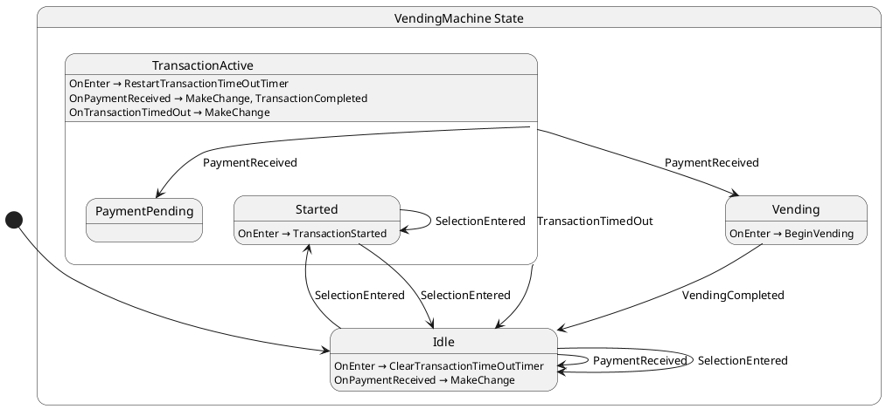

# 💡 LogicBlocks

[![Chickensoft Badge][chickensoft-badge]][chickensoft-website] [![Discord][discord-badge]][discord] [![Read the docs][read-the-docs-badge]][docs] ![line coverage][line-coverage] ![branch coverage][branch-coverage]

Human-friendly state management for games and apps in C#.

Logic blocks borrow from [statecharts], [state machines][state-machines], and [blocs][bloc-pattern] to provide a flexible and easy-to-use API.

Logic blocks allow developers to define self-contained states that read like ordinary code using the [state pattern][state-pattern] instead of requiring developers to write elaborate transition tables. Logic blocks are intended to be refactor-friendly and grow with your project from simple state machines to nested, hierarchical statecharts.

> 🖼 Ever wondered what your code looks like? LogicBlocks includes an experimental generator that allows you to visualize your logic blocks as a state diagram!

---

<p align="center">

</p>

---

**A logic block is a class that can receive inputs, maintain a state, and produce outputs.** How you design your states is up to you. Outputs allow logic block listeners to be informed about one-shot events that aren't persisted the way state is, allowing the logic block to influence the world around it without tight coupling. Additionally, logic block states can retrieve values shared across the entire logic block from the logic block's *blackboard*.

Here is a minimal example. More ✨ advanced ✨ examples are linked below.

```csharp
namespace Chickensoft.LogicBlocks.Generator.Tests;

[StateMachine]
public class LightSwitch :
  LogicBlock<LightSwitch.Input, LightSwitch.State, LightSwitch.Output> {
  public override State GetInitialState(Context context) =>
    new State.Off(context);

  public abstract record Input {
    public record Toggle : Input;
  }

  public abstract record State(Context Context) : StateLogic(Context) {
    public record On(Context Context) : State(Context), IGet<Input.Toggle> {
      State IGet<Input.Toggle>.On(Input.Toggle input) => new Off(Context);
    }

    public record Off(Context Context) : State(Context), IGet<Input.Toggle> {
      State IGet<Input.Toggle>.On(Input.Toggle input) => new On(Context);
    }
  }

  public abstract record Output { }
}
```

Logic blocks come with a simple binding system that allows them to be observed easily.

```csharp
var lightSwitch = new LightSwitch();
var binding = lightSwitch.Bind();

binding.When<LightSwitch.State.On>()
  .Call((state) => Console.WriteLine("Light turned on."));

binding.When<LightSwitch.State.Off>()
  .Call((state) => Console.WriteLine("Light turned off."));
```

Finally, the logic blocks source generator can be used to produce a UML diagram of the statechart your code represents.

## 👩‍🏫 Examples

- [**`LightSwitch.cs`**](Chickensoft.LogicBlocks.Generator.Tests/LightSwitch.cs)

  
- [**`Heater.cs`**](Chickensoft.LogicBlocks.Generator.Tests/Heater.cs)

  
- [**`ToasterOven.cs`**](Chickensoft.LogicBlocks.Generator.Tests/ToasterOven.cs)

  
- [**`VendingMachine.cs`**](Chickensoft.LogicBlocks.Example/VendingMachine.cs)

  The Vending Machine example shows a fully built CLI app that simulates a vending machine, complete with timers, inventory, and cash return.

  
  
  

## 💡 Why LogicBlocks?

Logic blocks attempt to achieve the following goals:

- 🎁
  **Self-contained states**.
  
  Rather than writing and maintaining a transition table, logic blocks allow you to define states and optionally restrict what states they can transition to next. Restricting states can be done by overriding `bool CanGoTo<>(TState state)`. By default, this returns true for every state, allowing your state to transition to any other state. Restricting what states an individual state can go to will enable the logic block to prevent invalid state transitions.

  Many state machine libraries require you to define state transition tables up-front and implement logic outside of the states themselves by examining the previous and next state. By treating states as self-contained, logic blocks should be easier to build, maintain, and reason about than traditional table-based systems.

  The logic block API is modeled after [Moore machines][Moore], in that each state is considered self-contained and declares what states it can transition to. Conversely, logic blocks also benefit from the design of [Mealy machines][Mealy]: their states can examine the previous state when entering a state, as well as examine the next state when exiting a state. This, in my opinion, combines the "best of both worlds" and plays nicely with object-oriented programming.

- 💪 **Reliable execution, even when errors occur.**

  The error handling mechanism is heavily inspired by the one from the canonical implementation of [bloc]. No more invalid transition exceptions, missing input handler warnings, etc.

- 🪆 **Nested / hierarchical states.**

  Since logic blocks treat states as self contained objects, you can simply use inheritance to represent composite states for your state hierarchies. In Addition, registered state entrance and exit callbacks are called in the correct order for nested states.

- 🧨 **Support outputs**.

  Outputs are just plain objects which can contain related data that listeners may be interested in. An output may be produced at any point during the execution of a logic block.

- 🔄 **Synchronous and asynchronous input processing**.

  Logic blocks come in two varieties: `LogicBlock` and `LogicBlockAsync`.
  
  As you might have guessed, all input and lifecycle handlers are asynchronous in the async version. Using async handlers can be helpful when your states need to interact with services that are inherently asynchronous, such as network requests or file I/O.
  
  On the other hand, keeping things synchronous is great where performance or simplicity is a concern, such as in a single-threaded game loop.

- 📝 **Ordered input processing.**

  All inputs are processed one-at-a-time, in order. If the current state does not have an input handler for the current input, the input is simply discarded.

- 👩‍💻 **Developer-friendly.**

  Logic blocks are designed to be ergonomic, refactor-friendly, and scale with you as you iterate on your intended state behaviors.

  If for any reason you ever decide to migrate away from logic blocks to a table-based state machine approach, the conversion from a Moore machine (self-contained states also leveraged by LogicBlocks) to a Mealy machine (transition-based logic) is [quite trivial](https://electronics.stackexchange.com/a/73397). The other way around is not nearly as easy.

- 🤝 **Compatibility.**

  Works anywhere `netstandard2.1` is supported. Use with Godot, Unity, or other C# projects.

- 🪢 **Fluent bindings built-in**.

  Logic blocks come with `Binding`, a utility class that provides a fluent API for monitoring states and outputs. Binding to a logic block is as simple as calling `myLogicBlock.Bind()`.

## 📦 Installation

You can find the latest version of LogicBlocks on [nuget][logic-blocks-nuget].

```sh
dotnet add package Chickensoft.LogicBlocks
```

To use the LogicBlocks source generator, add the following to your `.csproj` file. Make sure to replace `1.3.0` with the latest version of the [LogicBlocks generator from nuget][logic-blocks-gen-nuget].

```xml
  <PackageReference Include="Chickensoft.LogicBlocks.Generator" Version="1.3.0" PrivateAssets="all" OutputItemType="analyzer" />
```

## 🙋‍♀️ How to Use LogicBlocks

Since LogicBlocks are based on statecharts, it helps to understand the basics of statecharts. Here are a few resources to help you get started:

- [Introduction to State Machines and Statecharts][xstate-intro]
- [Statecharts.dev][statecharts]
- [UML State Machine (Wikipedia)][uml-state-machine]

### Creating a LogicBlock

To make a logic block, you'll need an idea for a state machine or statechart. Drawing one out from a diagram (or implementing an existing diagram) is a great way to get started.

Once you have a basic idea of what you want to build, create a new class that represents your machine and extends either `LogicBlock` or `LogicBlockAsync`.

For this example, we'll create a simple state machine that models a space heater used to a heat a room when it's cold outside.

Inside of the class, we need to define a base input type, state type, and output type. Since we need access to the [nested types] inside LogicBlock, we can declare our input, state, and output types as nested types inside our own machine class. Nesting types like this also allows the logic blocks generator to find our types and generate diagrams of our code.

```csharp
[StateMachine]
public class Heater :
  LogicBlock<Heater.Input, Heater.State, Heater.Output> {
    public abstract record Input { }
    public abstract record State(Context Context) : StateLogic(Context) {
      
    }
    public abstract record Output { }
  }
```

Logic block state types must implement `IStateLogic` or extend `StateLogic`. Since `StateLogic` implements `IStateLogic`, we can use it as a base class for our states since we're using records to define our states.

The `IStateLogic` interface requires your state to have a `Context` property. The `Context` is simply an object which allows your state to interact with the logic block that owns the state without having to have direct knowledge about it.

[C# records][records] are useful for defining logic block states since they include shallow value-based equality out-of-the-box. Records are also convenient to use for inputs and outputs since we can take advantage of the shorthand [primary constructor] syntax.

We've added the `[StateMachine]` attribute to our logic block class to tell the LogicBlock source generator about our machine. This means the generator will be able to find the types and generate the diagram code so we can see what our machine looks like.

### Defining Inputs and Outputs

Once we have a basic LogicBlock implementation in place, we can define our inputs and outputs.

Inputs are just values that contain whatever data is needed for the state to do its job. A logic block queues inputs up and processes them one at a time. The current state is responsible for handling whatever input is currently being processed. If it doesn't handle it, the input is simply discarded and any remaining inputs are processed the same way.

Outputs are one-shot values that are produced by states and sent to any listeners of the logic block. Outputs can be used to keep views or other visualization systems (like game components) in-sync with the current state of the machine.

In statecharts terminology, inputs are analogous to statechart `events`, and outputs are analogous to statechart `actions`.

```csharp
  public abstract record Input {
    public record TurnOn : Input;
    public record TurnOff : Input;
    public record TargetTempChanged(double Temp) : Input;
    public record AirTempSensorChanged(double AirTemp) : Input;
  }

  public abstract record Output {
    public record AirTempChanged(double AirTemp) : Output;
  }
```

Each of our inputs represent something that has happened related to the machine we're designing. Since we're modeling a space heater, we've provided inputs for all the things that might happen, such as turning it on and off, changing the target temperature, and receiving a new reading from the air temperature sensor.

### Defining States

We know our space heater will be in one of three states: `Off`, `Idle`, and `Heating`. Since our imaginary space heater has a knob that controls the desired room temperature (the target temperature), we know that all of our states should have a `TargetTemp` property.

We'll go ahead and write out the first two states, `Off` and `Idle`:

```csharp
  public abstract record State(Context Context, double TargetTemp)
    : StateLogic(Context) {
    
    public record Off(
      Context Context, double TargetTemp
    ) : State(Context, TargetTemp), IGet<Input.TurnOn> {
      State IGet<Input.TurnOn>.On(Input.TurnOn input) =>
        new Heating(Context, TargetTemp);
    }

    public record Idle(Context Context, double TargetTemp) :
      State(Context, TargetTemp);
  }
```

Note that we changed our overall state to include a `TargetTemp`, and both `Off` and `Idle` pass values from their constructors to it.

We also added the `IGet<Input.TurnOn>` interface to `Off`. This interface tells the logic block that `Off` can handle the `Input.TurnOn` input. If the `Off` state is the current state when a `TurnOn` input is received, the logic block will automatically call the state's `On(Input.TurnOn input)` method that it implements to satisfy `IGet<Input.TurnOn>`. We can implement additional input handling by adding more implementations of `IGet<TInputType>` to our states.

In the case of `Off`, we only need to handle the `TurnOn` event. Input handlers always return the next state of the machine. In this case, we want to go to the `Heating` state, so let's create that next.

```csharp
    public record Heating : State,
      IGet<Input.TurnOff>,
      IGet<Input.AirTempSensorChanged>,
      IGet<Input.TargetTempChanged> {
        
      public Heating(Context context, double targetTemp) : base(
        context, targetTemp
      ) {
        var tempSensor = context.Get<ITemperatureSensor>();

        context.OnEnter<Heating>(
          (previous) => tempSensor.OnTemperatureChanged += OnTemperatureChanged
        );

        context.OnExit<Heating>(
          (next) => tempSensor.OnTemperatureChanged -= OnTemperatureChanged
        );
      }

      State IGet<Input.TurnOff>.On(Input.TurnOff input)
        => new Off(Context, TargetTemp);

      State IGet<Input.AirTempSensorChanged>.On(
        Input.AirTempSensorChanged input
      ) => input.AirTemp >= TargetTemp
        ? new Idle(Context, TargetTemp)
        : this;

      State IGet<Input.TargetTempChanged>.On(Input.TargetTempChanged input)
        => this with { TargetTemp = input.Temp };

      private void OnTemperatureChanged(double airTemp) {
        Context.Input(new Input.AirTempSensorChanged(airTemp));
        Context.Output(new Output.AirTempChanged(airTemp));
      }
    }
```

There's a lot going on! You probably noticed that this state handles multiple inputs: `TurnOff`, `AirTempSensorChanged`, and `TargetTempChanged`. A constructor is provided which uses the logic block context to register `OnEnter` and `OnExit` callbacks that are invoked when the state is entered or exited, respectively. In the callbacks, the state subscribes to the `OnTemperatureChanged` event of the temperature sensor. The temperature sensor is accessed by calling the context's `Get` method, which allows the state to lookup values provided to it by the logic block. We'll see how to provide these values in a moment.

When the `TurnOff` event is received, we simply turn the machine off. Likewise, whenever the target temperature knob is adjusted, we just return a copy of the current state with the new value of the target temperature provided by the input value.

Whenever the air temperature sensor informs us of a new value, the private method on the state, `OnTemperatureChanged`, uses the context to fire an input on the logic block that owns the state. The input is handled by the logic block's current state, which in this case would be the state triggering the input. Finally, the state also produces a logic block output for any of the logic block's listeners so they can react to the change in air temperature.

We're just about done with our LogicBlock — all we need to do is define the initial state and provide the temperature sensor to the states.

```csharp
[StateMachine]
public class Heater :
  LogicBlock<Heater.Input, Heater.State, Heater.Output> {

  public Heater(ITemperatureSensor tempSensor) {
    // Make sure states can access the temperature sensor.
    Set<ITemperatureSensor>(tempSensor);
  }

  public override State GetInitialState(Context context) =>
    new State.Off(context, 72.0);

}
```

We provide values to the logic block's *blackboard* of values by calling the `Set` method. The blackboard is a dictionary of values whose values can be accessed by looking up the type of the desired value. The blackboard is shared between the states via the context's `Get<TDataType>` method.

> You may have noticed we borrowed the term *blackboard* from behavior trees — it's a great way to keep dependencies from being strongly coupled between the states and the logic block.

Finally, we have to override the method that returns the initial state of the logic block, `GetInitialState`. We simply return the `Off` state with a target temperature of 72 degrees (fahrenheit).

### Using Our LogicBlock

In case you missed it above, the completed space heater example is available  in [`Heater.cs`](Chickensoft.LogicBlocks.Generator.Tests/Heater.cs).

To use our logic block, we'd have to first make a temperature sensor that conforms to the `ITemperatureSensor` interface that we never showed.

```csharp
public interface ITemperatureSensor {
  event Action<double>? OnTemperatureChanged;
}

public record TemperatureSensor : ITemperatureSensor {
  public event Action<double>? OnTemperatureChanged;

  public void UpdateReading(double airTemp) =>
    OnTemperatureChanged?.Invoke(airTemp);
}
```

That'll do. Now, somewhere in our app or game's code, we can create a new instance of our logic block and bind to it.

```csharp
  // Somewhere in your program...

  var tempSensor = new TemperatureSensor();
  var heater = new Heater(tempSensor);

  // Bindings implement IDisposable, so we can use the `using` shorthand here.
  using Heater.Binding binding = heater.Bind();

  // Outputs are handled by calling the binding's `Handle` method.
  binding.Handle<Heater.Output.AirTempChanged>(
    (output) => Console.WriteLine($"Air temp changed to {output.AirTemp}")
  );

  // You can use the `When` method to subscribe to specific types of states.
  binding.When<Heater.State.Off>().Call(
    (state) => Console.WriteLine("Heater is off")
  );

  binding.When<Heater.State.Idle>().Call(
    (state) => Console.WriteLine("Heater is idle")
  );

  heater.Input(new Heater.Input.TurnOn());

  // Since the logic block subscribes to the temp sensor, it will automatically
  // update itself if it's in the heating state. We don't have to care about 
  // what state it's in to manipulate the temperature sensor, either!
  tempSensor.UpdateReading(64);
```

## 🖼 Generating State Diagrams

The LogicBlocks generator can generate UML code that can be used to visualize the statechart that your code represents.

> 🪄 Generating diagrams based on code promotes a code-first solution: instead of having to maintain a separate diagram, your code acts as the source of truth for your state machines. As a bonus, your diagrams will never be out of date!

See [installation](#-installation) for instructions on installing the LogicBlocks source generator.

To instruct the LogicBlocks generator to create a UML state diagram for your code, add the `[StateMachine]` attribute to your LogicBlock's definition:

```csharp
[StateMachine]
public class LightSwitch :
  LogicBlock<LightSwitch.Input, LightSwitch.State, LightSwitch.Output> {
```

> The `[StateMachine]` attribute code is automatically injected by the source generator.

State diagrams will be generated for each logic block with the `[StateMachine]` attribute in your project. The diagram code is placed next to your LogicBlock's source file with the extension `.g.puml`.

For example, here's the UML generated for the VendingMachine example mentioned above:



### Viewing Diagrams with PlantUML

You can copy and paste the generated UML into [PlantText] to generate a diagram online.

Alternatively, you can install PlantUML locally and use the [jebbs.plantuml] VSCode extension to render UML state diagrams that represent your machine.

Installation steps (for macOS):

```sh
brew install graphviz
brew install plantuml

# To start your own PlantUML server:
java -jar /opt/homebrew/Cellar/plantuml/1.2023.9/libexec/plantuml.jar -picoweb
# ^ May need to change path above to match the version you installed.
# Try `brew info plantuml` to see where PlantUML is installed.
```

Once the server is running, you can preview the diagram by opening the VSCode command menu and selecting "PlantUML: Preview Current Diagram".

## 📺 Credits

Conceptually, logic blocks draw from a number of inspirations:

- 📊 [Statecharts][statecharts]

  Logic blocks borrow the idea of ["actions"](https://statecharts.dev/glossary/action.html) from statecharts. To avoid confusion with C#'s Action delegates, statechart actions are known as "outputs" within logic blocks.

  Outputs provide a way of communicating with the world outside the logic block without introducing strong coupling between the logic block and whatever is listening to it (like a game engine component or a view).

  Logic block states can also use normal object-oriented programming patterns like inheritance and composition to recreate the nested or hierarchical nature of state charts.

- 🧊 [Bloc][bloc]

  Logic blocks borrow heavily from the conventions put forth by bloc: notably, `On<TInput>`-style input handlers, inheritance-based states, `AddError`, `OnError`, and asynchronous input processing.

- 🎰 [Finite state machines][state-machines].

  The logic blocks API is heavily inspired by [Moore] and [Mealy] state machines.

  Defining logic in terms of transitions is the definition of a Mealy state machine (see above). Unfortunately, requiring developers to create logic in terms of transitions is a bit clunky. Oftentimes, many transitions share common code which must be factored out. Forgetting to call the shared code from each relevant transition introduces serious logic errors. Instead, the logic blocks API embraces self-contained states that are invoked when entered and exited. Logic blocks do, however, provide a way to monitor transitions so that you can produce outputs when certain transitions occur, but they do not permit you to change the state while observing a transition.

[chickensoft-badge]: https://raw.githubusercontent.com/chickensoft-games/chickensoft_site/main/static/img/badges/chickensoft_badge.svg
[chickensoft-website]: https://chickensoft.games
[discord-badge]: https://raw.githubusercontent.com/chickensoft-games/chickensoft_site/main/static/img/badges/discord_badge.svg
[discord]: https://discord.gg/gSjaPgMmYW
[read-the-docs-badge]: https://raw.githubusercontent.com/chickensoft-games/chickensoft_site/main/static/img/badges/read_the_docs_badge.svg
[docs]: https://chickensoft.games/docsickensoft%20Discord-%237289DA.svg?style=flat&logo=discord&logoColor=white
[line-coverage]: Chickensoft.LogicBlocks.Tests/badges/line_coverage.svg
[branch-coverage]: Chickensoft.LogicBlocks.Tests/badges/branch_coverage.svg

[bloc]: https://bloclibrary.dev/#/
[bloc-pattern]: https://www.flutteris.com/blog/en/reactive-programming-streams-bloc
[state-machines]: https://en.wikipedia.org/wiki/Finite-state_machine
[Moore]: https://en.wikipedia.org/wiki/Moore_machine
[Mealy]: https://en.wikipedia.org/wiki/Mealy_machine
[state-pattern]: https://en.wikipedia.org/wiki/State_pattern
[statecharts]: https://statecharts.dev/
[jebbs.plantuml]: https://marketplace.visualstudio.com/items?itemName=jebbs.plantuml
[logic-blocks-nuget]: https://www.nuget.org/packages/Chickensoft.LogicBlocks/
[logic-blocks-gen-nuget]: https://www.nuget.org/packages/Chickensoft.LogicBlocks.Generator/
[uml-state-machine]: https://en.wikipedia.org/wiki/UML_state_machine
[xstate-intro]: https://xstate.js.org/docs/guides/introduction-to-state-machines-and-statecharts/
[records]: https://learn.microsoft.com/en-us/dotnet/csharp/whats-new/tutorials/records
[primary constructor]: https://learn.microsoft.com/en-us/dotnet/csharp/language-reference/builtin-types/record
[nested types]: https://learn.microsoft.com/en-us/dotnet/csharp/programming-guide/classes-and-structs/nested-types
[PlantText]: https://www.planttext.com/
