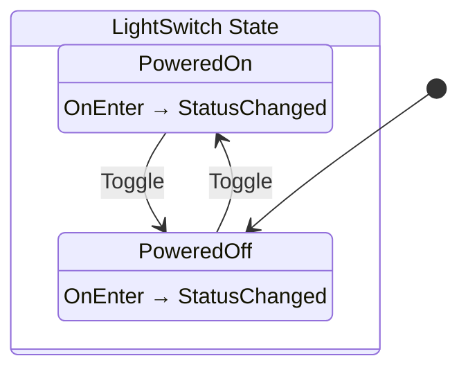

# 💡 LogicBlocks

[![Chickensoft Badge][chickensoft-badge]][chickensoft-website] [![Discord][discord-badge]][discord] [![Read the docs][read-the-docs-badge]][docs] ![line coverage][line-coverage] ![branch coverage][branch-coverage]

LogicBlocks is a serializable, hierarchical state machine package for C# that works well when targeting ahead-of-time (AOT) environments. LogicBlocks draws inspiration from [statecharts], [state machines][state-machines], and [blocs][bloc-pattern].

---

<p align="center">

</p>

---

Instead of elaborate transition tables, states are simply defined as self-contained class records that read like ordinary code using the [state pattern][state-pattern]. Logic blocks are designed with performance, adaptability, and error tolerance in mind, making them refactor-friendly and suitable for high performance scenarios (such as games).

Logic blocks grow with your code: you can start with a simple state machine and easily scale it into a nested, hierarchical statechart that represents a more complex system — even while you're working out what the system should be.

## 📚 What to Read Next

Logic blocks are based on _statecharts_. You may also know them as hierarchical state machines (HSM's).

- 🚨 The Official ✨ [LogicBlocks Docs][docs] ✨

  Read this as soon as you're up to speed on statecharts.

- 🟢 [Introduction to State Machines and Statecharts][xstate-intro]

  **Beginner**: overview for those who are new to statecharts.

- 🟡 [Statecharts.dev][statecharts]

  **Intermediate**: all the statechart concepts in one place.

- 🔴 [UML State Machine (Wikipedia)][UML]

  **Expert**: all the juicy technical details are here.

- 🔵 [Logic Blocks Timer Tutorial][tutorial]

  **In a hurry?** Learn about hierarchical states and logic blocks all at once!

## 💡 Example

_A logic block is a class that **receives inputs**, **maintains a single state instance**, and **produces outputs**._

_Logic blocks enable you to efficiently model complex behaviors_[^1].

In v6, the logic block has **no generic type parameter**, states live **outside** the logic block class, and input handlers **return `Type`** instead of a `Transition` struct.

```csharp
// LightSwitchLogic.cs
public partial class LightSwitchLogic : LogicBlock
{
  public LightSwitchLogic()
  {
    // Preallocate states
    Set(new LightSwitchState.PoweredOn());
    Set(new LightSwitchState.PoweredOff());
  }
}
```

```csharp
public abstract partial record LightSwitchState : LogicBlockState
{
  public static class Input
  {
    public readonly record struct Toggle;
  }

  public static class Output
  {
    public readonly record struct StatusChanged(bool IsOn);
  }
}
```

```csharp
// LightSwitchStates.cs
public partial record LightSwitchState
{
  public record PoweredOn : LightSwitchState, IGet<Input.Toggle>
  {
    public PoweredOn()
    {
      this.OnEnter(() => Output(new Output.StatusChanged(IsOn: true)));
    }

    public Type On(in Input.Toggle input) => To<PoweredOff>();
  }

  public record PoweredOff : LightSwitchState, IGet<Input.Toggle>
  {
    public PoweredOff()
    {
      this.OnEnter(() => Output(new Output.StatusChanged(IsOn: false)));
    }

    public Type On(in Input.Toggle input) => To<PoweredOn>();
  }
}
```

```csharp
// Usage
using var logic = new LightSwitchLogic();
logic.Start<LightSwitchState.PoweredOff>();

logic.Input(new LightSwitchState.Input.Toggle());
// logic.State is now LightSwitchState.PoweredOn
```

## 🔗 Bindings

Observe a logic block by creating a binding. Bindings are `IDisposable` — dispose them when done.

```csharp
using var binding = logic.Bind();

binding
  .OnState<LightSwitchState.PoweredOn>(_ => Console.WriteLine("Light is on"))
  .OnState<LightSwitchState.PoweredOff>(_ => Console.WriteLine("Light is off"))
  .OnOutput<LightSwitchState.Output.StatusChanged>(
    output => Console.WriteLine($"Status changed: {output.IsOn}")
  )
  .OnStart(() => Console.WriteLine("Started"))
  .OnStop(() => Console.WriteLine("Stopped"));
```

## 🖼️ Visualizing Logic Blocks

LogicBlocks provides a source generator that can generate [UML state diagrams][UML] of your code.


```mermaid
stateDiagram-v2

state "LightSwitch State" as Chickensoft_LogicBlocks_DiagramGenerator_Tests_TestCases_LightSwitch_State {
  state "PoweredOn" as Chickensoft_LogicBlocks_DiagramGenerator_Tests_TestCases_LightSwitch_State_PoweredOn
  state "PoweredOff" as Chickensoft_LogicBlocks_DiagramGenerator_Tests_TestCases_LightSwitch_State_PoweredOff
}

Chickensoft_LogicBlocks_DiagramGenerator_Tests_TestCases_LightSwitch_State_PoweredOff --> Chickensoft_LogicBlocks_DiagramGenerator_Tests_TestCases_LightSwitch_State_PoweredOn : Toggle
Chickensoft_LogicBlocks_DiagramGenerator_Tests_TestCases_LightSwitch_State_PoweredOn --> Chickensoft_LogicBlocks_DiagramGenerator_Tests_TestCases_LightSwitch_State_PoweredOff : Toggle

Chickensoft_LogicBlocks_DiagramGenerator_Tests_TestCases_LightSwitch_State_PoweredOff : OnEnter → StatusChanged
Chickensoft_LogicBlocks_DiagramGenerator_Tests_TestCases_LightSwitch_State_PoweredOn : OnEnter → StatusChanged

[*] --> Chickensoft_LogicBlocks_DiagramGenerator_Tests_TestCases_LightSwitch_State_PoweredOff
```

Add `[StateDiagram]` to your base state class to enable diagram generation. Generated `*.g.puml` files are placed alongside your code. You can use [PlantUML] (and/or the [PlantUML VSCode Extension]) to visualize them.

```csharp
[StateDiagram]
public abstract partial record LightSwitchState : LogicBlockState { ... }
```

> [!TIP]
> A diagram explains all of the high-level behavior of a state machine in a single picture. Without a diagram, you would have to read through every relevant code file to understand the machine.

## 📜 History (Pushdown Automaton)

Logic blocks support a state history stack, enabling pushdown automaton behavior — push the current state type and pop it later to return to a previous state.

```csharp
public Type On(in Input.Pause input)
{
  Push();               // save current state type on the history stack
  return To<Paused>();
}

public Type On(in Input.Resume input)
{
  return Pop() ?? To<Playing>();  // restore previous state, or fall back
}
```

The history stack has a configurable maximum capacity (default: 8).

## ⚡ Async Inputs

Bridge async tasks safely back into the synchronous input pipeline using `Async()`:

```csharp
public Type On(in Input.Load input)
{
  Async(FetchDataAsync())
    .Input(data => new Input.Loaded(data))
    .ErrorInput(ex => new Input.LoadFailed(ex.Message))
    .CanceledInput(() => new Input.LoadCanceled());

  return ToSelf();
}
```

## 💾 Serialization (AutoBlock)

For logic blocks that need serialization, extend `AutoBlock` instead of `LogicBlock`. `AutoBlock` integrates with [Chickensoft.Introspection] and [Chickensoft.Serialization] to automatically discover and preallocate all concrete states, and to save/load state.

```csharp
[Meta, Id("my_logic")]
public partial class MyLogic : AutoBlock
{
  public MyLogic()
  {
    Preallocate<MyState>(); // discover and preallocate all concrete states
  }

  public override ILogicBlockSaveData GetSaveData(LogicBlockData data) =>
    new MySaveData { Data = data };
}
```

```csharp
// Save
var saveData = myLogic.Save();

// Load (resume from saved state)
myLogic.Start(saveData.Data);
```

## 🧪 Testing

### Testing States

Test individual states in isolation using `state.Test()`:

```csharp
var state = new LightSwitchState.PoweredOff();
var tester = state.Test();

tester.Set(new SomeDependency());
state.Enter();

tester.Outputs.ShouldContain(new LightSwitchState.Output.StatusChanged(IsOn: false));
```

### Testing Bindings

Use `LogicBlock.CreateFakeBinding()` to test binding callbacks without a real logic block:

```csharp
using var binding = LogicBlock.CreateFakeBinding();

binding.OnState<LightSwitchState.PoweredOn>(_ => ranCallback = true);

binding.SetState(new LightSwitchState.PoweredOn());
ranCallback.ShouldBeTrue();
```

## 🤫 Differences from Statecharts

In the interest of convenience, logic blocks have a few subtle differences from statecharts:

- 💂‍♀️ No explicit guards

  Use conditional logic in an input handler

- 🪢 Attach/Detach callbacks

  These are an implementation specific detail that are called whenever the state _instance_ changes, as opposed to only being called when the state type hierarchy (i.e., state configuration) changes.

- 🕰️ No event deferral

  Non-handled inputs are simply discarded. There's nothing to stop you from implementing [input buffering] on your own, though: you may even use the [boxless queue] collection that LogicBlocks uses internally.

LogicBlocks also uses different terms for some of the statechart concepts to make them more intuitive or disambiguate them from other C# terminology.

| statecharts         | logic blocks    |
| ------------------- | --------------- |
| internal transition | self transition |
| event               | input           |
| action              | output          |

[^1]: Simple behaviors, like the light switch example, are considerably more verbose than they need to be. Logic blocks shine brightest when they're used for things that actually require hierarchical state machines.

---

Looking for more? **Read the ✨ [docs]! ✨**

---
🐣 Package generated from a 🐤 Chickensoft Template — <https://chickensoft.games>

[chickensoft-badge]: https://chickensoft.games/img/badges/chickensoft_badge.svg
[chickensoft-website]: https://chickensoft.games
[discord-badge]: https://chickensoft.games/img/badges/discord_badge.svg
[discord]: https://discord.gg/gSjaPgMmYW
[read-the-docs-badge]: https://chickensoft.games/img/badges/read_the_docs_badge.svg
[docs]: https://chickensoft.games/docs/logic_blocks
[branch-coverage]: Chickensoft.LogicBlocks.Tests/badges/branch_coverage.svg
[line-coverage]: Chickensoft.LogicBlocks.Tests/badges/line_coverage.svg

[xstate-intro]: https://xstate.js.org/docs/guides/introduction-to-state-machines-and-statecharts/
[statecharts]: https://statecharts.dev/
[UML]: https://en.wikipedia.org/wiki/UML_state_machine
[PlantUML VSCode Extension]: https://marketplace.visualstudio.com/items?itemName=jebbs.plantuml
[PlantUML]: https://plantuml.com/
[input buffering]: https://supersmashbros.fandom.com/wiki/Input_Buffering
[boxless queue]: https://github.com/chickensoft-games/Collections?tab=readme-ov-file#boxless-queue
[bloc-pattern]: https://www.flutteris.com/blog/en/reactive-programming-streams-bloc
[state-machines]: https://en.wikipedia.org/wiki/Finite-state_machine
[state-pattern]: https://en.wikipedia.org/wiki/State_pattern
[tutorial]: https://chickensoft.games/docs/logic_blocks/tutorial
