# 💡 LogicBlocks

[![Chickensoft Badge][chickensoft-badge]][chickensoft-website] [![Discord][discord-badge]][discord] [![Read the docs][read-the-docs-badge]][docs] ![line coverage][line-coverage] ![branch coverage][branch-coverage]

LogicBlocks is a serializable, hierarchical state machine package for C# that works well when targeting ahead-of-time (AOT) environments. LogicBlocks draws inspiration from [statecharts], [state machines][state-machines], and [blocs][bloc-pattern].

---

<p align="center">

</p>

---

Instead of elaborate transition tables, states are simply defined as self-contained class records that read like ordinary code using the [state pattern][state-pattern]. Logic blocks are designed with performance, adaptability, and error tolerance in mind, making them refactor-friendly and suitable for high performance scenarios (such as games).

Logic blocks grow with your code: you can start with a simple state machine and easily scale it into a nested, hierarchical statechart that represents a more complex system — even while you're working out what the system should be.

## 📚 What to Read Next

Logic blocks are based on _statecharts_. You may also know them as hierarchical state machines (HSM's).

- 🚨 The Official ✨ [LogicBlocks Docs][docs] ✨

  Read this as soon as you're up to speed on statecharts.

- 🟢 [Introduction to State Machines and Statecharts][xstate-intro]

  **Beginner**: overview for those who are new to statecharts.

- 🟡 [Statecharts.dev][statecharts]

  **Intermediate**: all the statechart concepts in one place.

- 🔴 [UML State Machine (Wikipedia)][UML]

  **Expert**: all the juicy technical details are here.

- 🔵 [Logic Blocks Timer Tutorial][tutorial]

  **In a hurry?** Learn about hierarchical states and logic blocks all at once!

## 💡 Example

_A logic block is a class that **receives inputs**, **maintains a single state instance**, and **produces outputs**._

_Logic blocks enable you to efficiently model complex behaviors_[^1].

```csharp
using Chickensoft.Introspection;

[Meta, LogicBlock(typeof(State), Diagram = true)]
public class LightSwitch : LogicBlock<LightSwitch.State> {
  public override Transition GetInitialState() => To<State.PoweredOff>();

  public static class Input {
    public readonly record struct Toggle;
  }

  public abstract record State : StateLogic<State> {
    public record PoweredOn : State, IGet<Input.Toggle> {
      public Transition On(in Input.Toggle input) => To<PoweredOff>();
    }

    public record PoweredOff : State, IGet<Input.Toggle> {
      public Transition On(in Input.Toggle input) => To<PoweredOn>();
    }
  }

  public static class Output {
    public readonly record struct StatusChanged(bool IsOn);
  }
}
```

## 🖼️ Visualizing Logic Blocks

LogicBlocks provides a source generator that can generate [UML state diagrams][UML] of your code.

```mermaid
stateDiagram-v2

state "LightSwitch State" as Chickensoft_LogicBlocks_DiagramGenerator_Tests_TestCases_LightSwitch_State {
  state "PoweredOn" as Chickensoft_LogicBlocks_DiagramGenerator_Tests_TestCases_LightSwitch_State_PoweredOn
  state "PoweredOff" as Chickensoft_LogicBlocks_DiagramGenerator_Tests_TestCases_LightSwitch_State_PoweredOff
}

Chickensoft_LogicBlocks_DiagramGenerator_Tests_TestCases_LightSwitch_State_PoweredOff --> Chickensoft_LogicBlocks_DiagramGenerator_Tests_TestCases_LightSwitch_State_PoweredOn : Toggle
Chickensoft_LogicBlocks_DiagramGenerator_Tests_TestCases_LightSwitch_State_PoweredOn --> Chickensoft_LogicBlocks_DiagramGenerator_Tests_TestCases_LightSwitch_State_PoweredOff : Toggle

Chickensoft_LogicBlocks_DiagramGenerator_Tests_TestCases_LightSwitch_State_PoweredOff : OnEnter → StatusChanged
Chickensoft_LogicBlocks_DiagramGenerator_Tests_TestCases_LightSwitch_State_PoweredOn : OnEnter → StatusChanged

[*] --> Chickensoft_LogicBlocks_DiagramGenerator_Tests_TestCases_LightSwitch_State_PoweredOff
```



Generated UML diagrams are placed alongside the code for your logic block with the `*.g.puml` extension. You can use [PlantUML] (and/or the [PlantUML VSCode Extension]) to visualize the generated diagram code.

> [!TIP]
> A diagram explains all of the high level behavior of a state machine in a single picture. Without a diagram, you would have to read and scroll through all the relevant code files to understand the machine (especially if you weren't the author, or forgot how it worked since you had written it).

## 🤫 Differences from Statecharts

In the interest of convenience, logic blocks have a few subtle differences from statecharts:

- 💂‍♀️ No explicit guards

  Use conditional logic in an input handler

- 🪢 Attach/Detach callbacks

  These are an implementation specific detail that are called whenever the state _instance_ changes, as opposed to only being called when the state type hierarchy (i.e., state configuration) changes.

- 🕰️ No event deferral

  Non-handled inputs are simply discarded. There's nothing to stop you from implementing [input buffering] on your own, though: you may even use the [boxless queue] collection that LogicBlocks uses internally.

LogicBlocks also uses different terms for some of the statechart concepts to make them more intuitive or disambiguate them from other C# terminology.

| statecharts         | logic blocks    |
| ------------------- | --------------- |
| internal transition | self transition |
| event               | input           |
| action              | output          |

[^1]: Simple behaviors, like the light switch example, are considerably more verbose than they need to be. Logic blocks shine brightest when they're used for things that actually require hierarchical state machines.

---

Looking for more? **Read the ✨ [docs]! ✨**

--- 
🐣 Package generated from a 🐤 Chickensoft Template — <https://chickensoft.games>

[chickensoft-badge]: https://raw.githubusercontent.com/chickensoft-games/chickensoft_site/main/static/img/badges/chickensoft_badge.svg
[chickensoft-website]: https://chickensoft.games
[discord-badge]: https://raw.githubusercontent.com/chickensoft-games/chickensoft_site/main/static/img/badges/discord_badge.svg
[discord]: https://discord.gg/gSjaPgMmYW
[read-the-docs-badge]: https://raw.githubusercontent.com/chickensoft-games/chickensoft_site/main/static/img/badges/read_the_docs_badge.svg
[docs]: https://chickensoft.games/docs/logic_blocks
[branch-coverage]: Chickensoft.LogicBlocks.Tests/badges/branch_coverage.svg
[line-coverage]: Chickensoft.LogicBlocks.Tests/badges/line_coverage.svg

[xstate-intro]: https://xstate.js.org/docs/guides/introduction-to-state-machines-and-statecharts/
[statecharts]: https://statecharts.dev/
[UML]: https://en.wikipedia.org/wiki/UML_state_machine
[PlantUML VSCode Extension]: https://marketplace.visualstudio.com/items?itemName=jebbs.plantuml
[PlantUML]: https://plantuml.com/
[input buffering]: https://supersmashbros.fandom.com/wiki/Input_Buffering
[boxless queue]: https://github.com/chickensoft-games/Collections?tab=readme-ov-file#boxless-queue
[bloc-pattern]: https://www.flutteris.com/blog/en/reactive-programming-streams-bloc
[state-machines]: https://en.wikipedia.org/wiki/Finite-state_machine
[state-pattern]: https://en.wikipedia.org/wiki/State_pattern
[tutorial]: https://chickensoft.games/docs/logic_blocks/tutorial
